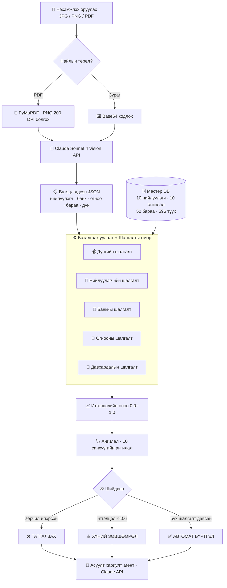

# Ухаалаг Нэхэмжлэхийн Агент — AI Legends 2026

Claude Vision API ашиглан Монгол санхүүгийн нэхэмжлэхийг автоматаар уншиж, баталгаажуулж, ангилаад, шийдвэр гаргадаг AI агент.

## Pipeline-ийн архитектур



### Алхамууд

```
Нэхэмжлэх (JPG/PNG/PDF)
        │
        ▼
  1. МЭДЭЭЛЭЛ ОЛБОРЛОХ   ← Claude Vision API → бүтэцлэгдсэн JSON
        │
        ▼
  2. БАТАЛГААЖУУЛАХ      ← SQLite мастер мэдээллийн сан дахь 5 шалгалт
        │
        ▼
  3. АНГИЛАХ             ← 10 санхүүгийн ангилал
        │
        ▼
  4. ШИЙДВЭР ГАРГАХ     ← АВТОМАТ БҮРТГЭЛ / ХҮНИЙ ЗӨВШӨӨРӨЛ / ТАТГАЛЗАХ
        │
        ▼
  5. АСУУЛТ ХАРИУЛТ     ← Claude API-аар нэгтгэсэн дүн шинжилгээ
```

## Баталгаажуулалтын шалгалтууд

| Шалгалт | Тайлбар |
|---------|---------|
| `AMOUNT_MISMATCH` | тоо × нэгжийн үнэ ≠ мөрийн дүн, эсвэл нийлбэр ≠ нийт дүн |
| `UNREGISTERED_VENDOR` | Нийлүүлэгч мастер мэдээллийн санд байхгүй |
| `BANK_ACCOUNT_MISMATCH` | Банк/данс нийлүүлэгчийн бүртгэлтэй таарахгүй |
| `INVALID_DATE` | Задлах боломжгүй огноо, 2-р сарын 30, эсвэл төлбөрийн огноо нэхэмжлэхийн өмнө |
| `DUPLICATE` | Түүхэн мэдээлэлд ижил нийлүүлэгч + огноо + дүн байна |

## Үр дүн (100 нэхэмжлэх боловсруулсан)

| Шийдвэр | Тоо |
|---------|-----|
| Автомат бүртгэл | 72 |
| Татгалзсан | 28 |
| Хүний зөвшөөрөл | 0 |

| Зөрчлийн төрөл | Тоо | Нэхэмжлэхийн дугаар |
|----------------|-----|---------------------|
| Банкны дансны зөрүү | 8 | 002, 003, 013, 015, 039, 053, 056, 075 |
| Дүнгийн зөрүү | 5 | 007, 028, 064, 080, 094 |
| Буруу огноо | 5 | 005, 022, 034, 066, 087 |
| Бүртгэлгүй нийлүүлэгч | 5 | 010, 026, 041, 088, 092 |
| Давхардсан нэхэмжлэх | 5 | 025, 035, 038, 047, 057 |

- Нийт дүн: **66,110,000₮**
- Татгалзсан дүн: **28,210,000₮**
- Файлын төрөл: JPG гар бичмэл (15), PNG дижитал (4), PDF дижитал (81)

## Тохиргоо

```bash
pip install -r requirements.txt
export ANTHROPIC_API_KEY="sk-ant-..."
```

## Pipeline ажиллуулах

```bash
python pipeline.py
```

## Streamlit демо ажиллуулах

```bash
streamlit run app.py
```

## Технологийн стек

- **Claude Sonnet 4** — Vision олборлолт + асуулт хариулт
- **PyMuPDF** — PDF хуудас зураг болгох
- **SQLite** — Нийлүүлэгч/бараа/түүхийн мастер мэдээллийн сан
- **Streamlit** — Интерактив демо интерфэйс

## Файлууд

| Файл | Тайлбар |
|------|---------|
| `pipeline.py` | 5 алхамт боловсруулалтын pipeline |
| `app.py` | Streamlit демо програм |
| `requirements.txt` | Python хамааралтай сангууд |

## Уралдаан

AI Legends 2026 — AI Агент Автоматжуулалтын Чиглэл
Зохион байгуулагч: Проф. Д.Золзаяа, ШУТИС
