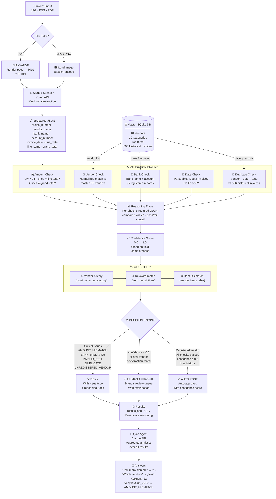
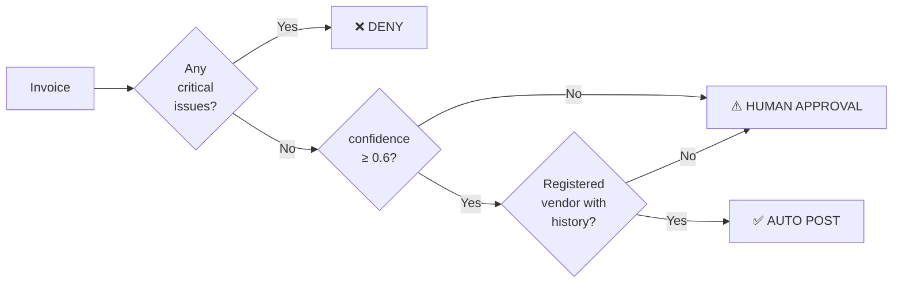

# System Architecture — AI Invoice Processing Agent

## Full Pipeline Diagram

## Decision Logic Summary

## Technology Stack

| Component | Technology |
|-----------|-----------|
| Vision & Q&A | Claude Sonnet 4 (Anthropic API) |
| PDF Rendering | PyMuPDF (fitz) |
| Master Database | SQLite |
| Demo UI | Streamlit |
| Chatbot Interface | React / JSX |
| Language | Python 3.10+ |
